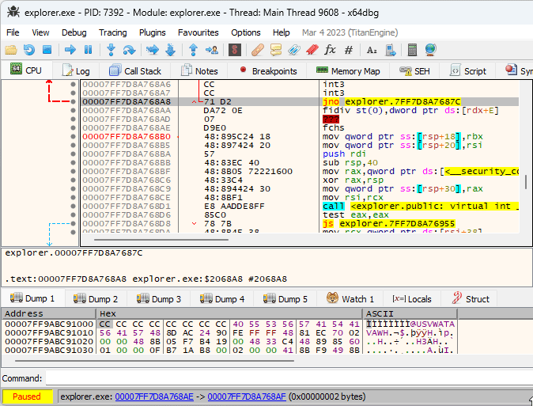

# x64dbg XFG Marker Plugin

[Microsoft eXtended Flow Guard
(XFG)](https://en.wikipedia.org/wiki/Control-flow_integrity#Microsoft_eXtended_Flow_Guard)
is a control-flow integrity (CFI) technique that extends CFG with function call
signatures. Each signature is 8 bytes long, and is located right before the
target function. Since the signature is located in the code section, x64dbg gets
confused and shows it as random instructions. This also often makes x64dbg
unable to correctly disassemble the beginning of the function.

The plugin goes over all XFG function call signatures and marks them as 8-byte
integers, creating a clear separation between the signature and the function.

